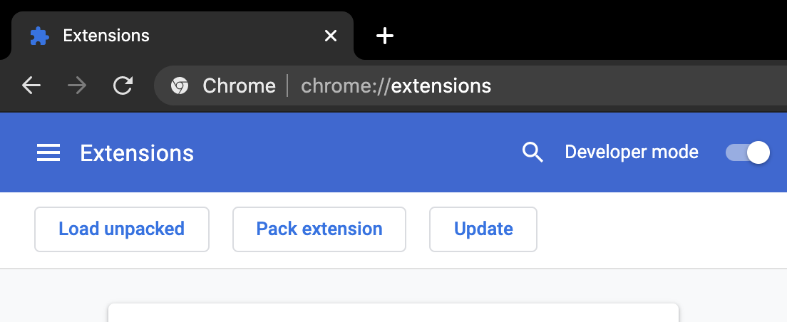
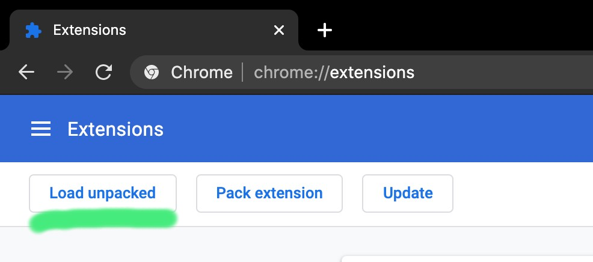

# A Gossip of Mermaids

Render mermaid.js diagrams right inside your chromium based browser with this extension.

## Installation instruction

Step 1. Clone this repo.

Step 2. Enable chrome extension developer mode.

Step 3. Load extension by clicking "Load unpacked" and locating the repo.

## License

Currently, all rights reserved. To be used by bKash labs team for internal development.

